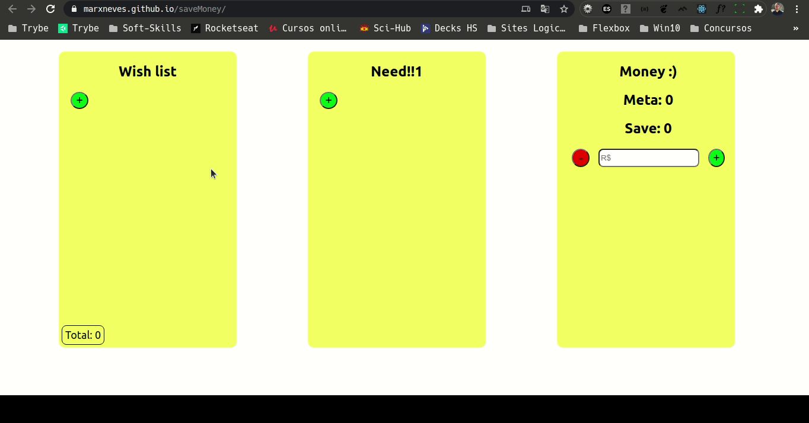

# Projeto Save Money

Esse projeto foi criado enquanto estava começando a estudar React Js e vi que podia fazer uma aplicação simples onde poderia me ajudar a traçar metas financeiras para guardar dinheiro e ver o quanto eu precisava para comprar aquilo que eu queria, e ao mesmo tempo treinar e aplicar os meu conhecimentos de React.

# A APLICAÇÃO

## Link para a aplicação: [Save Money](https://marxneves.github.io/saveMoney/)

Desenvolvido por Marx Khristie.

